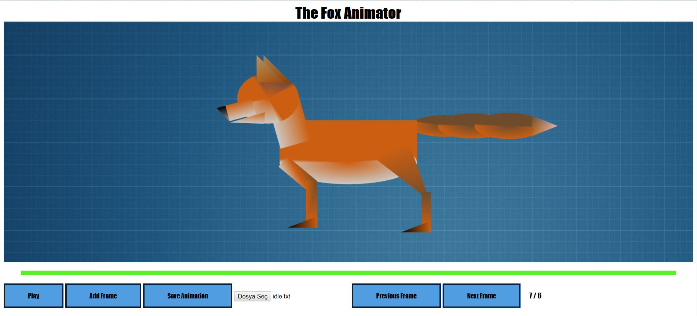
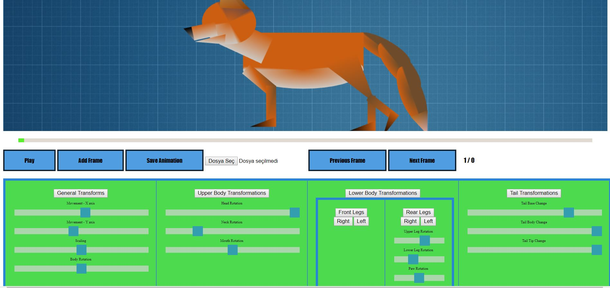
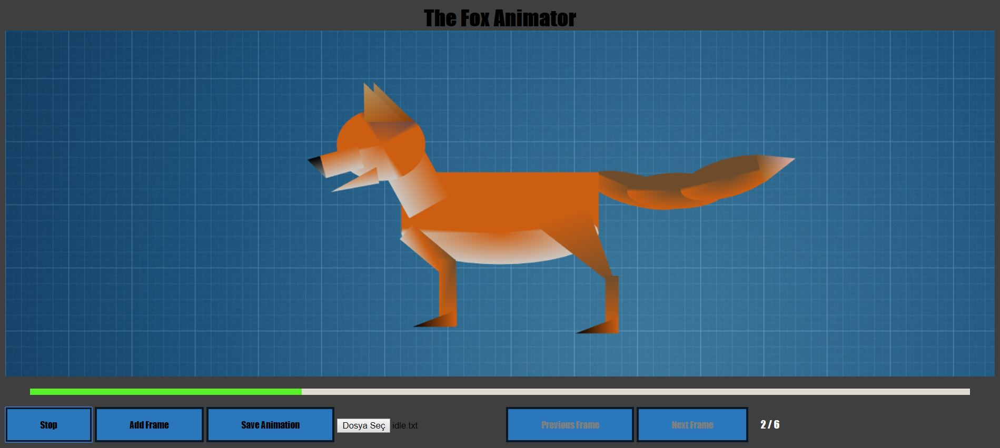

The Fox Animator
-
A 2-D Animation program with a built in model happens to be a fox. Developped in WebGL.
Features include:

  -Interpolation between key frames using a easy In/Out for natural movements.
  -
  -Slider and accordion based interface for model transformations.
  -
  -Progress bar to indicate time of the current frame in the animation
  -
  -Interactive display of character the model.
  -
  -Save/Load animation
  -
  -Extensible classes and methods for future development.
  -

